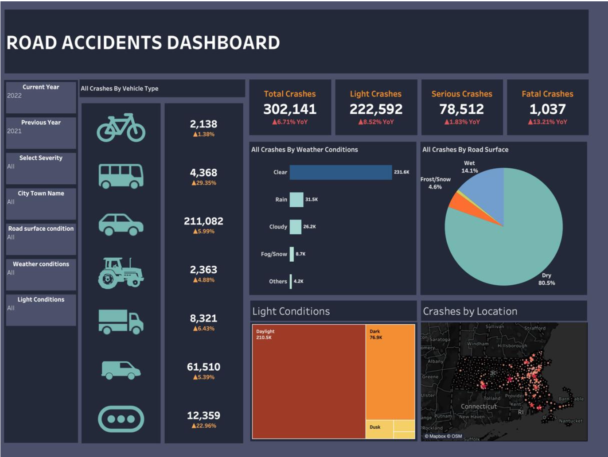
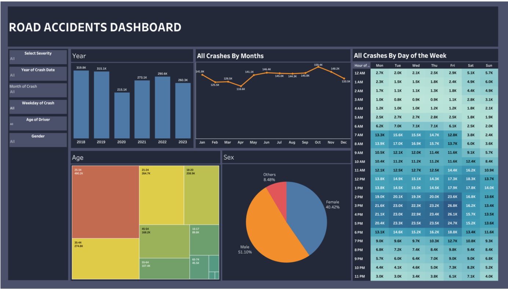

# Road Safety in Numbers: Decoding Road Accident Patterns in Massachusetts

## Overview
This project analyzes road accident patterns in Massachusetts using data from the Massachusetts Department of Transportation. Our goal is to extract meaningful insights and trends to improve road safety policies and preventive measures. We leverage data visualization and statistical analysis to uncover accident trends across different factors such as time, demographics, weather, and road conditions.

## Problem Statement
The project aims to analyze the Massachusetts Road Crash Dataset to identify patterns in accident occurrences and inform data-driven road safety improvements. Our research seeks to answer key questions such as:

- Are there seasonal or weekly patterns in road accidents?
- Do age and gender influence accident likelihood?
- How do weather and road surface conditions affect accident rates?
- Are there notable differences in accident occurrences during daylight vs. nighttime?

## Data Description
- **Dataset Size**: 1.04 million rows, 40 columns.
- **Timeframe**: 2018 - 2023.
- **Source**: Massachusetts government open data portal - [MassDOT Impact Crashes](https://massdot-impact-crashes-vhb.opendata.arcgis.com/).
- **Data Preparation**:
  - Merging individual CSV files from each year.
  - Handling missing values (interpolation, removal of null values).
  - Detecting and removing outliers.

## Methodology
1. **Data Preprocessing**:
   - Standardizing and cleaning dataset.
   - Identifying key variables related to accident causes.
   - Addressing missing values and anomalies.

2. **Visualization Techniques**:
   - **Bar Charts**: Frequency of accidents by year and month.
   - **Pie Charts**: Distribution of accidents by gender and road surface conditions.
   - **Heat Maps**: Relationship between age groups and accident occurrences.
   - **Geographic Heat Maps**: Identifying accident-prone locations.
   - **Horizontal Bar Charts**: Accidents categorized by weather conditions.
   - **Vehicle Type Analysis**: Understanding the impact of vehicle types on accident rates.

3. **Interactive Dashboard**:
   - Filters allow users to analyze data by severity, location, road/weather conditions, and lighting.
   - "Current Year" vs. "Previous Year" comparison for trend analysis.
   - 📊 **Explore the interactive dashboard on Tableau**: [View Dashboard](https://public.tableau.com/app/profile/vikramadithya.pabba/viz/RoadSafety_17118164935630/RoadSafety)

    
    

## Key Findings
- **COVID-19 Impact**: Accidents significantly decreased in 2020 due to lockdown restrictions.
- **Seasonal Trends**: Higher accident rates from August to November, possibly due to weather changes (fog, sleet).
- **Time-based Trends**:
  - Peak accidents occur on **Friday afternoons (3 PM - 6 PM)** due to rush hours.
  - Fatal accidents are more common **at night (11 PM - 2 AM)**.
- **Demographics**:
  - Male drivers have higher accident involvement, but this may be due to their higher presence on the roads.
- **Environmental Factors**:
  - Most accidents occur under clear weather and dry road conditions, suggesting human error plays a major role.
  - Wet roads and rainy conditions still contribute significantly, highlighting the need for better road safety measures.
- **Vehicle Analysis**: Passenger vehicles are involved in the majority of accidents.
- **Lighting Conditions**: More accidents occur in daylight than at night, indicating that visibility alone is not a dominant factor—traffic volume may be a more significant contributor.
- **Geographical Trends**: Coastal cities experience a higher number of accidents, helping pinpoint high-risk areas for intervention.

## Conclusion
Our analysis provides a data-driven approach to enhancing road safety measures. Key takeaways include:
- **Seasonal safety strategies**: Increased traffic management during high-risk months.
- **Targeted education**: Focused campaigns for young drivers and high-risk demographics.
- **Infrastructure improvements**: Enhancing road safety in accident-prone locations.
- **Weather-based interventions**: Encouraging safer driving during adverse conditions.
- **Defensive driving awareness**: Reinforcing education on driver behavior and accident prevention.

By leveraging data visualization and statistical analysis, this study highlights critical areas for intervention and future road safety improvements in Massachusetts.

## Authors
- Vikramaditya Pabba  
